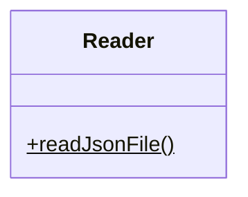
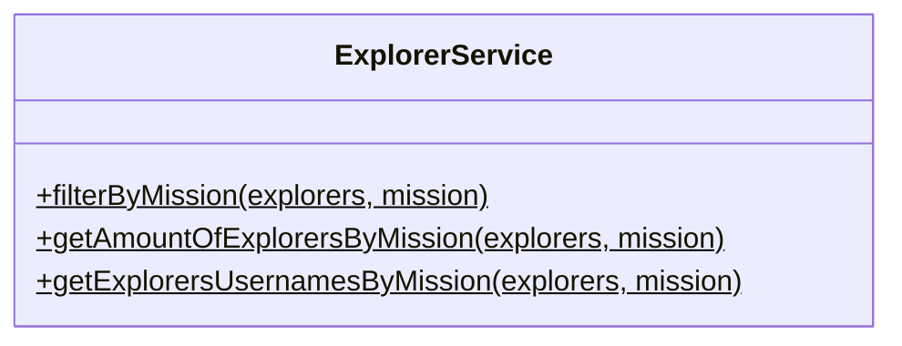
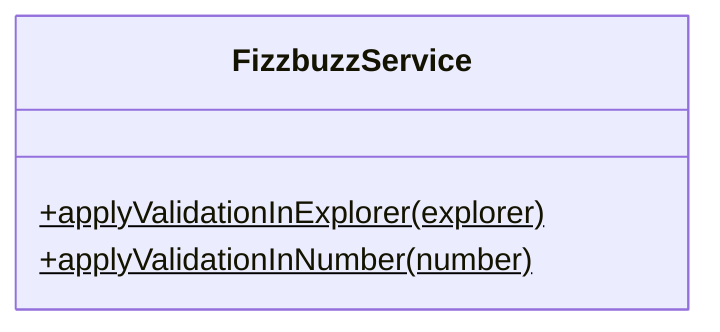
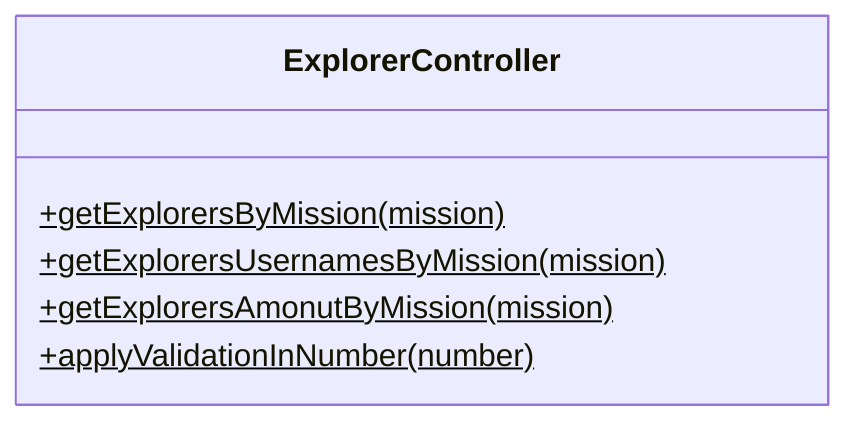

# Proyecto FizzBuzz

> Practica de LaunchX

En este proyecto se llevo a cabo lo siguiente:

- Se analizo un proyecto legado.
- Se crearon pruebas unitarias.
- Se refactorizo el proyecto y se crearon diferentes clases.
- Se instancio un servidor con ayuda de express.
- Se creo una API con diferentes endpoints para tener acceso a la funcionalidad del sistema.

## Clases

### Dependencias

1. Jest
2. Express
3. ESLint

